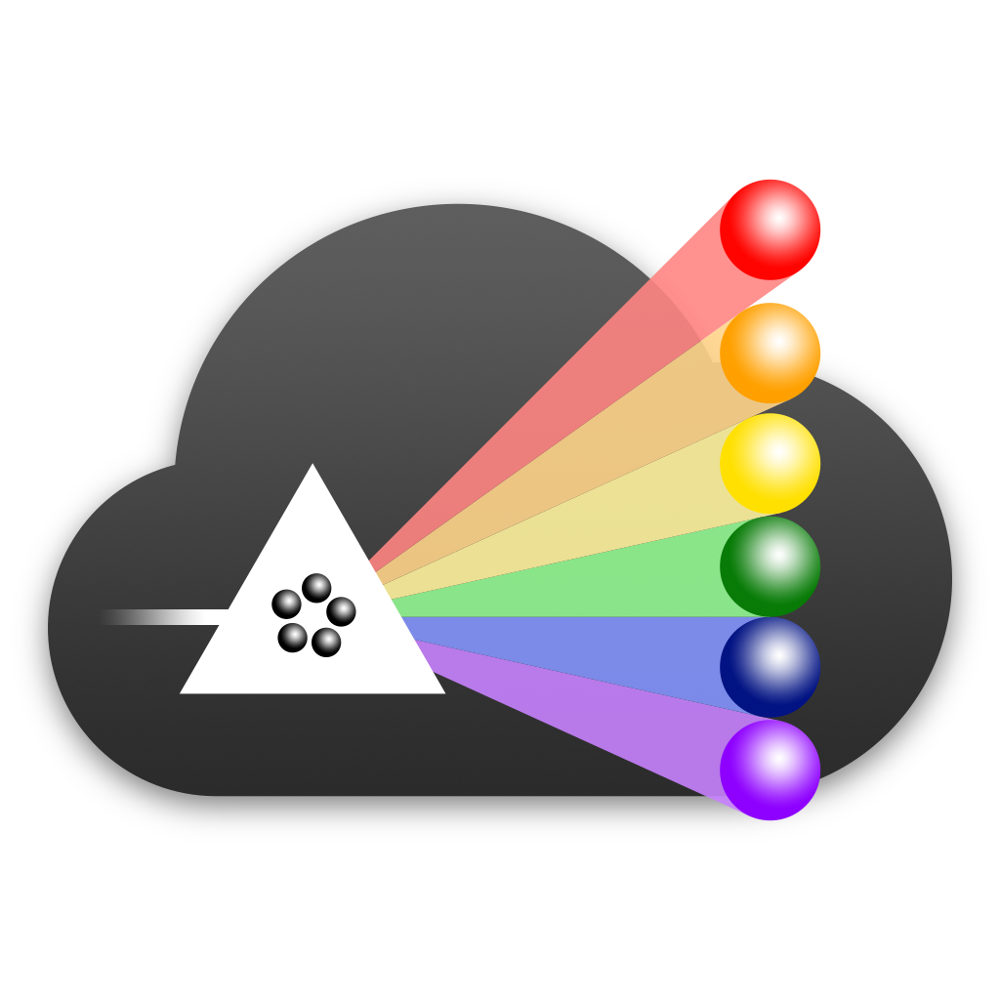

<div align='center'>

<br />



<h2>CINCO CLOUD - BACKEND</h2>

This service is build on the [Quarkus][quarkus] framework and developed in Java 11.

</div>

## Run the application

You can run your application in dev mode that enables live coding using:

```shell script
./mvnw compile quarkus:dev
```

> **_NOTE:_**  Quarkus now ships with a Dev UI, which is available in dev mode only at http://localhost:8080/q/dev/.

## Packaging and running the application

The application can be packaged using:
```shell script
./mvnw package
```
It produces the `quarkus-run.jar` file in the `target/quarkus-app/` directory.
Be aware that it’s not an _über-jar_ as the dependencies are copied into the `target/quarkus-app/lib/` directory.

If you want to build an _über-jar_, execute the following command:
```shell script
./mvnw package -Dquarkus.package.type=uber-jar
```

The application is now runnable using `java -jar target/quarkus-app/quarkus-run.jar`.

## Further commands

| Maven Command | Description |
|---------------|-------------|
| `./mvnw checkstyle:check` | Execute checkstyle validation |

## Database migrations

Database migrations are done using [Flyway][flyway].
Migration scripts can be found under `src/main/resources/db/migration`.

[flyway]: https://flywaydb.org/

## License

[EPL2](https://www.eclipse.org/legal/epl-2.0/)