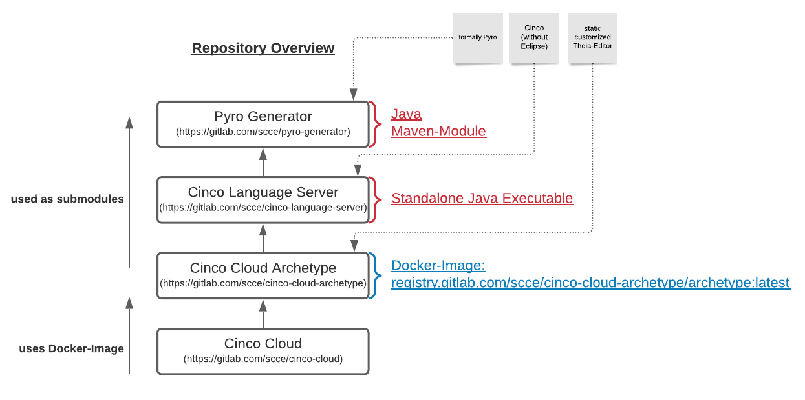

# Developer Guide

## Overview of Repositories
There are several repositories involved in the concept of Cinco Cloud.

Here you see a quick overview of all the repositories and their relations:



[**Cinco Cloud**](https://gitlab.com/scce/cinco-cloud):
The *Cinco-Cloud repository* contains the *main-app*, which orchestrates the image deployment of editors and functions as central administration instances for the user- and project management.

[**Cinco Cloud Archetype**](https://gitlab.com/scce/cinco-cloud-archetype):
The *Cinco-Cloud Archetype repository* holds the sources for the static editor, which is based on *Eclipse Theia*, including all *theia and visual-studio-code* based *extensions*. One of these extensions can execute the *Cinco Language Server*, thus the project also contains the *Cinco Language Server*-repository as a submodule. Since this repository represents the most basic deployable Editor for a Cinco-Cloud project, it is continuously built to a docker-image via a CICD pipeline and put into a docker registry (registry.gitlab.com/scce/cinco-cloud-archetype/archetype:latest). This image will be reused and further expressed for new *Cinco Cloud projects*.

[**Cinco Language Server**](https://gitlab.com/scce/cinco-language-server):
The *Cinco language Server* itself first and foremost is a standalone Java executable. It serves language support for the *Cinco Languages* (CPD, MGL, Style/MSL) and a Generator to express new *Cinco Cloud Projects* based on these languages. A great part of this repository is based on the *Cinco*-repository, but without the *Eclipse-IDE dependencies*.

[**Pyro Generator**](https://gitlab.com/scce/pyro-generator):
The *Pyro Generator* is a maven-submodule for both *Cinco* and the *Cinco Language Server*. It expresses *Cinco Cloud Projects* based on the *Cinco Languages*. It is based on the formally known *Pyro*-repository.

## Preparations

*For CincoCloud to run locally, ensure that you have at least 60GB of free disc space available.*

1. Install the following software
    - [Docker][docker]
    - [Helm][helm]
    - [Skaffold][skaffold]
    - [Minikube][minikube]

    - If you're running Windows:
    
        Activate `hyper-v` in Windows. It will be used instead of docker. Also, you need atleast `60GB` of disk-storage and administrator-rights. Almost all commands need to be run with high privileges, because of the `hyper-v`-context.

2. Run a local Kubernetes cluster
    1. Start the cluster: `minikube start --cpus 4 --memory 8192` (CincoCloud works best with 4 CPU cores and 8Gb of RAM)
    
        - on Windows: `minikube start --cpus 4 --memory 8192 --driver=hyperv --disk-size 60000mb`

            NOTE: With this command the diskspace is set to around 60GB from which about 30GB are used for the registry of the infrastructure. If you run into issues, adjust this value. We recommend to use Windows only for development purpose, but not for real deployment.

    2. Enable necessary plugins:

    ```
      minikube addons enable default-storageclass && \
      minikube addons enable ingress && \
      minikube addons enable ingress-dns && \
      minikube addons enable storage-provisioner
    ```

3. Add the minikube IP address to the `/etc/hosts` file
    1. Execute `minikube ip` to retrieve the IP address
    2. Add an entry to the `/etc/hosts`: `<IP> cinco-cloud`
        - on Windows: `C:\Windows\System32\drivers\etc\hosts`

4. Create a deploy token in the [cinco cloud archetype repository][cinco-cloud-archetype] with `read_registry` rights

5. Create a `secrets.yaml` file and add the following secret, for `<USERNAME>` and `<PASSWORD>` base64 encode and enter the credentials from step 4:

    ```
    apiVersion: v1
    kind: Secret
    metadata:
      name: cinco-cloud-archetype-registry-credentials
    type: Opaque
    data:
      username: <USERNAME>
      password: <PASSWORD>
    ```

6. Create and apply secrets for the GitLab registry
    1. Create a secret for the cinco cloud repository:
        - `kubectl create secret docker-registry cinco-cloud-registry-secret --docker-server=registry.gitlab.com --docker-username=<USERNAME> --docker-password=<USERNAME> --dry-run=client -o yaml`
    2. Create a secret for the cinco cloud archetype repository:
        - `kubectl create secret docker-registry cinco-cloud-archetype-registry-secret --docker-server=registry.gitlab.com --docker-username=<USERNAME> --docker-password=<USERNAME> --dry-run=client -o yaml`
    3. Copy the terminal output in the`secrets.yaml` file

7. Apply the secret to the cluster: `kubectl apply -f secrets.yaml`


## Installation

1. Clone the repository and ensure that the cluster is running
2. In the root of the repository directory, execute `skaffold dev` and wait for all pods to be deployed
3. Open `http://cinco-cloud` in a Web browser

[helm]: https://helm.sh/
[docker]: https://docs.docker.com/get-docker/
[skaffold]: https://skaffold.dev/
[minikube]: https://minikube.sigs.k8s.io/
[docker-secret]: https://kubernetes.io/docs/tasks/configure-pod-container/pull-image-private-registry/
[cinco-cloud-archetype]: https://gitlab.com/scce/cinco-cloud-archetype
