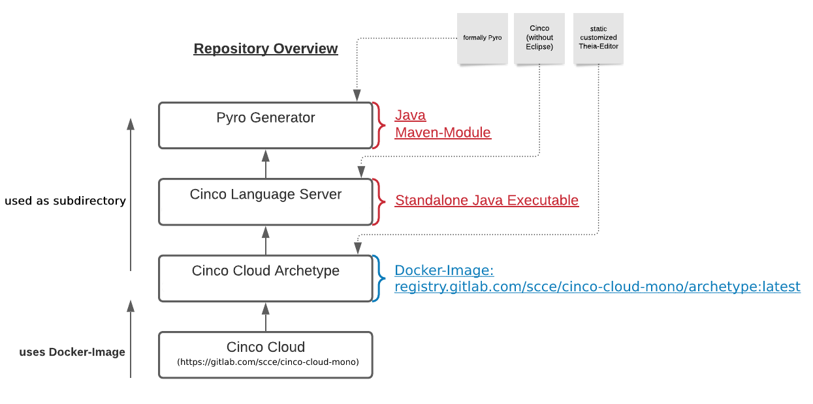
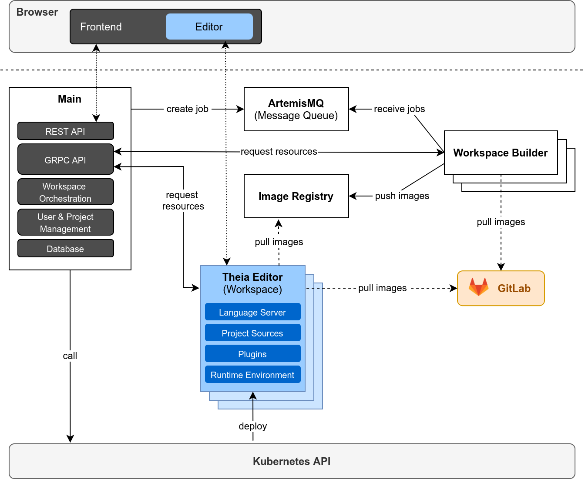

# Overview

## Directories

There are several projects involved in the concept of Cinco Cloud that can be found in the repository.
Here you see a quick overview of all the directories and their relations:

[**Cinco Cloud**](https://gitlab.com/scce/cinco-cloud/-/tree/main/cinco-cloud):
The *cinco-cloud* directory contains the *main-app*, which orchestrates the image deployment of editors and functions as central administration instances for the user- and project management.

[**Cinco Cloud Archetype**](https://gitlab.com/scce/cinco-cloud/-/tree/main/cinco-cloud-archetype):
The *cinco-cloud-archetype* directory holds the sources for the static editor, which is based on *Eclipse Theia*, including all *theia and visual-studio-code* based *extensions*.
One of these extensions can execute the *Cinco Language Server*, thus the project also contains the *Cinco Language Server*-project as a sub-directory.
Since this directory represents the most basic deployable Editor for a Cinco-Cloud project, it is continuously built to a docker-image via a CICD pipeline and put into a docker registry (registry.gitlab.com/scce/cinco-cloud/archetype:latest).
This image will be reused and further expressed for new *Cinco Cloud projects*.

[**Cinco Language Server**](https://gitlab.com/scce/cinco-cloud/-/tree/main/cinco-language-server):
The *cinco-language-server* itself is a standalone Java executable.
It serves language support for the *Cinco Languages* (CPD, MGL, Style/MSL) and a Generator to express new *Cinco Cloud Projects* based on these languages.
A great part of this project is based on the *Cinco*-repository, but without the *Eclipse-IDE dependencies*.

[**Pyro Generator**](https://gitlab.com/scce/cinco-cloud/-/tree/main/pyro-generator):
The *pyro-generator* is a sub-directory for the *Cinco Language Server*.
It expresses *Cinco Cloud Projects* based on the *Cinco Languages*.
It is based on the formally known *Pyro*-repository.

## Architecture

### Services

In the following, you can find a list of services that CincoCloud is composed of.

**Main Service** Forked from the Pyro code base, the main service is composed of a Postgres database, a [Quarkus][quarkus] backend and an [AngularDart][angular-dart] frontend that are connected through a RESTful API.
The service can be understood as the orchestrator of the displayed service landscape.
State is stored and managed soley in the database of the *Main Service*, other services can request and manipulate data through a [GRPC][grpc] interface that is exposed.
Further, the service is connected to the Kubernetes API of the cluster which is used for the orchestration of workspaces, i.e. it handles the creation and the garbage collection of inactive workspaces.

**Theia Editor**
The *Theia Editor* is a framework for IDEs, based on [Eclipse Theia](https://github.com/eclipse-theia/theia).
It represents the artifact that can be deployed by the *Kubernetes API*.
Its most basic form for the *Cinco-Cloud*, without specialization for a language, can be found inside the [*Cinco Cloud Archetype*](https://gitlab.com/scce/cinco-cloud/-/tree/main/cinco-cloud-archetype).
Each project that is deployed by a user via the CincoCloud frontend corresponds to exactly one Theia-based workspace.
There are two kinds of editors that can be deployed: for the meta-level, a **Language Editor** is deployed that behaves similar to Cinco in a sense that we can define our graphical languages and write our generators here.
The other one is a concrete **Model Editor** that uses parts of the Pyro front- and backend and allows graphical modelling.
In contrast to the language editor, the model editor is deployed together with an additional database, where graphical models are persisted in a serialized form.

## Secrets

We need to have the following secrets (see the instruction on how to create and apply them [here](../installation/)) in the cluster:

* `cinco-cloud-main-secrets`  
  Secrets as key value pairs that are used by different services.
  It contains the secret that is used to hash user passwords and various encoded credentials for e.g. the database and Minio.
  The secret is of type `opaque`.

[cinco-cloud-container-registry]: https://gitlab.com/scce/cinco-cloud/container_registry
[grpc]: https://grpc.io/
[podman]: https://podman.io/
[quarkus]: https://quarkus.io/
[angular-dart]: https://github.com/angulardart/angular

## Collaboration Protocol

