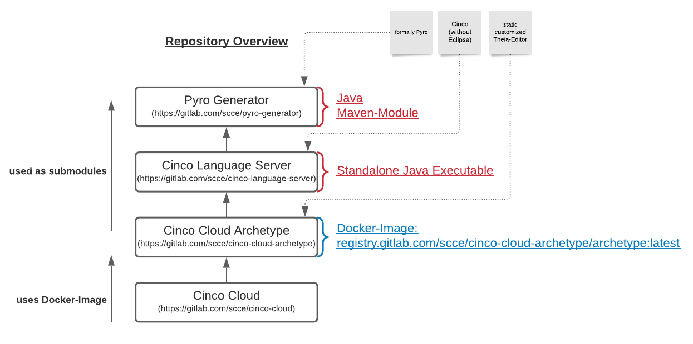

# Overview

## Repositories

There are several repositories involved in the concept of Cinco Cloud.
Here you see a quick overview of all the repositories and their relations:

[**Cinco Cloud**](https://gitlab.com/scce/cinco-cloud):
The *Cinco-Cloud repository* contains the *main-app*, which orchestrates the image deployment of editors and functions as central administration instances for the user- and project management.

[**Cinco Cloud Archetype**](https://gitlab.com/scce/cinco-cloud-archetype):
The *Cinco-Cloud Archetype repository* holds the sources for the static editor, which is based on *Eclipse Theia*, including all *theia and visual-studio-code* based *extensions*.
One of these extensions can execute the *Cinco Language Server*, thus the project also contains the *Cinco Language Server*-repository as a submodule.
Since this repository represents the most basic deployable Editor for a Cinco-Cloud project, it is continuously built to a docker-image via a CICD pipeline and put into a docker registry (registry.gitlab.com/scce/cinco-cloud-archetype/archetype:latest).
This image will be reused and further expressed for new *Cinco Cloud projects*.

[**Cinco Language Server**](https://gitlab.com/scce/cinco-language-server):
The *Cinco language Server* itself first and foremost is a standalone Java executable.
It serves language support for the *Cinco Languages* (CPD, MGL, Style/MSL) and a Generator to express new *Cinco Cloud Projects* based on these languages.
A great part of this repository is based on the *Cinco*-repository, but without the *Eclipse-IDE dependencies*.

[**Pyro Generator**](https://gitlab.com/scce/pyro-generator):
The *Pyro Generator* is a maven-submodule for both *Cinco* and the *Cinco Language Server*.
It expresses *Cinco Cloud Projects* based on the *Cinco Languages*.
It is based on the formally known *Pyro*-repository.
