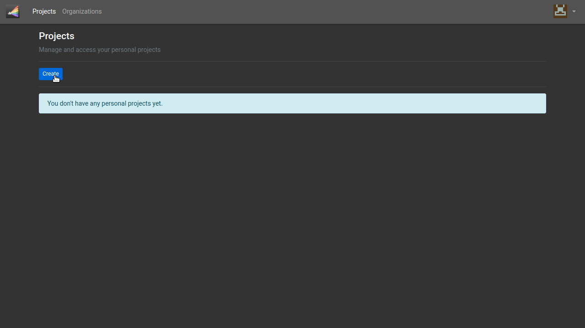
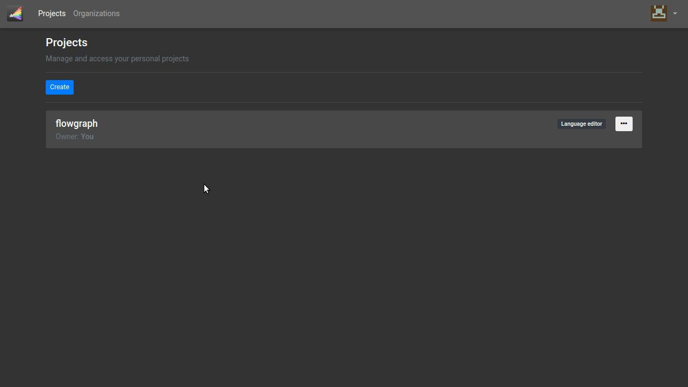
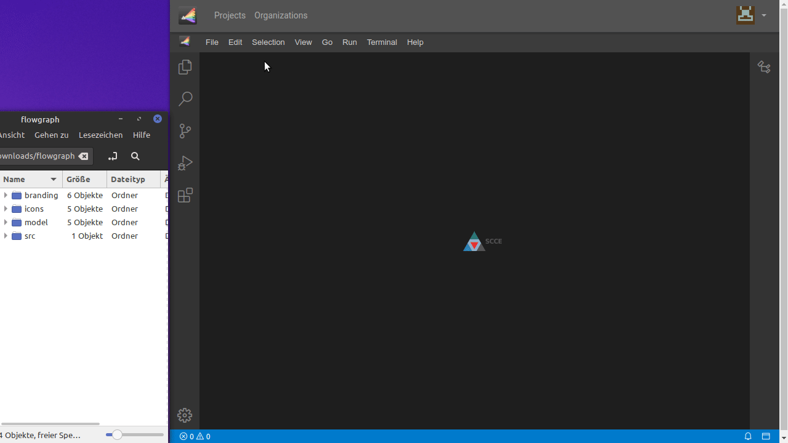
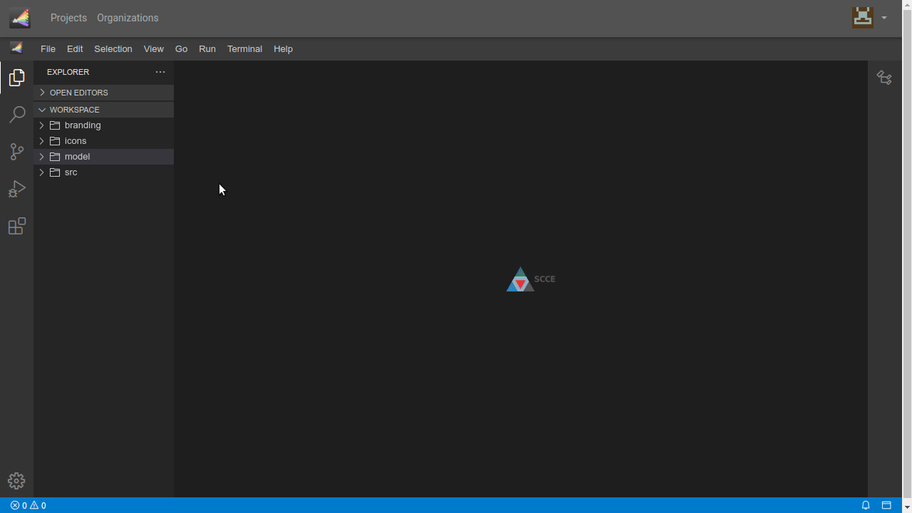
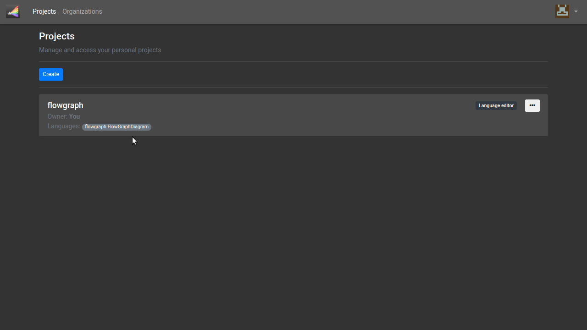
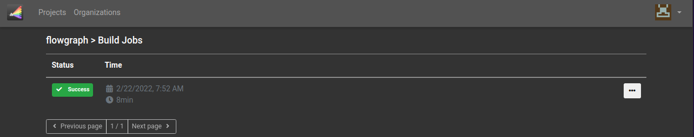
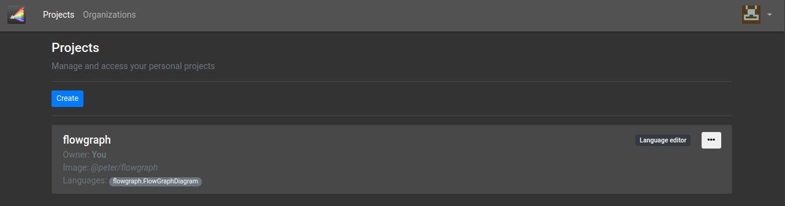
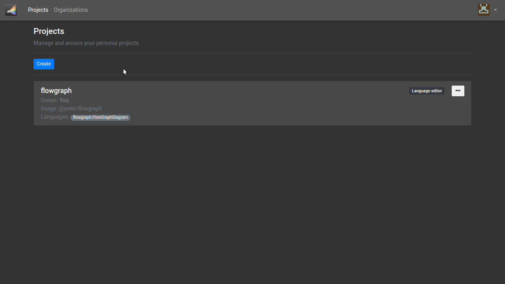
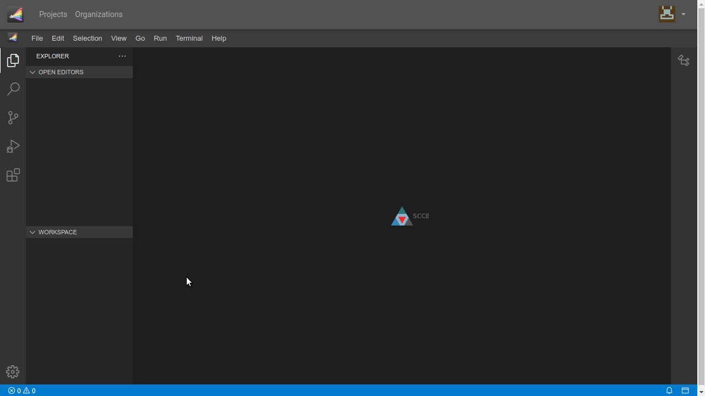

# Building Cinco products in CincoCloud

In this guide, we show you how you can use your existing Cinco languages in CincoCloud.
For this to work, ensure that you do not have any Eclipse-specific dependencies in your project and that the tool is Pyro-enabled, .i.e your CPD file contains the `@pyro` annotation.
For this walk-through, we use the Flowgraph project as an example.

## 1. Create a new project

After the login, we first create a new "empty project" which refers to the IDE in which we write our Cinco languages and the corresponding generators.

## 2. Open the Theia editor

Open the editor by clicking on the project.
CincoCloud then creates a new instance of a web-based editor just for your project.
After some initial loading time, the editor is displayed.

## 3. Upload an existing Cinco project

If you already have an existing Cinco project, you can just upload the sources of it into your web-based workspace.
Therefore, open the explorer in the left panel and drag and drop the required sources from your local machine to upload them in the workspace.

## 4. Generate the Cinco product

Instead of Eclipse-based Cinco products, CincoCloud generates a Pyro-based editor for your product that will also be provided by CincoCloud. 
Open the `cpd` file of your project and click on the white play button in the top right corner, right beside the editor tabs.
In the dialog *"Do you want to deploy the generated product?"* click *"Yes"*. 
You should now see a `pyro.zip` file being generated into your workspace.

## 5. Wait for the building process to finish

The generation of the Cinco product takes some time, but you can see live updates about the building process on the corresponding overview page for each project.

After some time, the status badge for the process should be *"Sucess"*.

In the project view, you can now see that an image has been assigned to the project.
In this case, the name of the image is `@peter/flowgraph` which represents the Pyro product generated from the Cinco languages in the namespace of the currently logged in user *peter*.

## 6. Create a project for the Cinco product

Now we can deploy a Pyro-based editor based on our Flograph languages.
Therefore, create a new project, select the option *"From template"*, enter a name for the project and in the *"Template"* field, search for the corresponding image.
You can then open the new editor by clicking on the newly created project.

## 7. Create graphmodel files

Finally, in the open editor, you can create new files for the languages of your MGLs.
Therefore, open the context menu in the workspace panel and choose the item *"New Graphmodel"*.
In the dialog that opens on top of the page, select the language you want to create files for and give it a name.
After the creation, the Pyro-based editor opens automatically.

