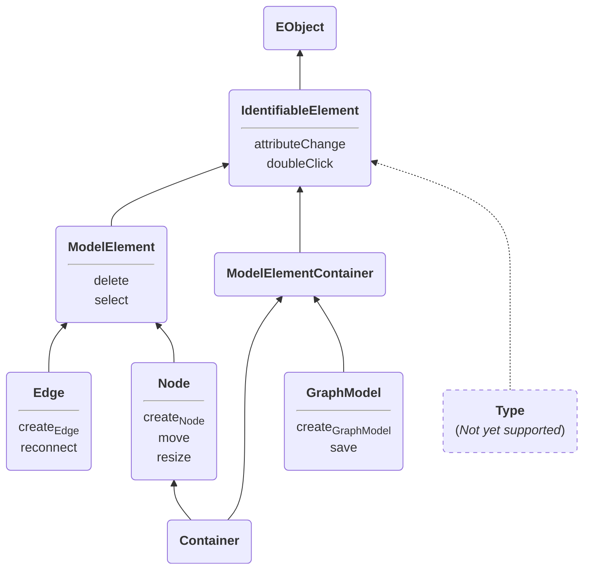

# Cinco Cloud Hooks

Cinco Cloud Hooks allow you to hook to certain operations in your Cinco product. These operations include:

- creating and deleting model elements,
- moving and resizing model elements,
- selecting model elements,
- reconnecting edges,
- changing attributes and
- saving the graph model.

Each event (ideally) supports 3 hooks that you may implement:

- `can` event method: Check whether the event is allowed to proceed or must be aborted.
- `pre` event method: Prepare for the incoming event.
- `post` event method: Clean up after the event.

## Table of contents

1. [How to use](#how-to-use)
2. [Notes](#notes)
3. [Troubleshooting](#troubleshooting)
4. [Example](#example)
5. [Currently Supported Hooks](#currently-supported-hooks)

## How to use

1. Open your MGL file
2. Add a `@Hooks("className")` annotation to each `graphModel`, `node`, `container` or `edge` that you want to use events on.
3. Create a class that extends the corresponding abstract class (`AbstractGraphModelHooks`, `AbstractNodeHook`, `AbstractEdgeHooks`)
4. Override the desired hooks and add them to the list of `hookTypes`.
5. Don't forget to register your hook class by calling `className.register();`

## Notes

- Parameters
  - Each model element must use a unique class name in the `@Hooks` annotation parameter.
  - The abstract hook class contains method stubs for each hook supported by the model element. ([See list below.](#currently-supported-hooks))
- Inheritance
  - Events are inherited by default. This means, if `NodeA` uses `@event(...)` and `NodeB` extends `NodeA`, `NodeB` will use the same events as `NodeA`. ([See example below.](#example))
  - You can add additional hook classes by adding `@Hooks(...)` to the sub-element. ([See example below.](#example))
- The order of execution for each event is as follows (simplified):

  ```typescript
  if (canEvent(element, ...)) {
      preEvent(element, ...)
      element.doSomething(...) // The actual event
      postEvent(element, ...)
  }
  ```

- Special case `postDelete`:
  - Using the execution order as above would cause a problem.
  - The element that was deleted cannot be passed as a parameter to the `postDelete(...)` method.
  - Therefore, the `postDelete(...)` method is executed before the actual deletion and must return a `java.lang.Runnable`.
  - The (still existing) element is passed as a parameter and can be used to set up the `Runnable`.
  - The `Runnable` is executed after the deletion.
  - The execution order for a `delete` event is as follows (simplified):

    ```java
    if (canDelete(element)) {
        preDelete(element)
        val postDeleteRunnable = postPostDelete(element)
        element.delete()
        postDeleteRunnable.run()
    }
    ```

- Special case `canCreate` `GraphModel`:
  - Because `GraphModel` is created by a wizard, the return type of their `canCreate(...)` method is a `String` rather than the usual `boolean`.
  - The `String` must contain a suitable error message, if the `GraphModel` cannot be created.
  - The `String` will be displayed in the wizard page.
  - If the `GraphModel` can be created, the return value must be `null`.
  - The execution order for a `create` `GraphModel` event is as follows (simplified):

    ```java
    val errorMessage = canCreate(...)
    if (errorMessage === null) {
        preCreate(...)
        val graph = create(...)
        postCreate(graph)
    }
    else {
        displayError(errorMessage)
    }
    ```

## Troubleshooting

tbd.

## Example

### SomeGraph.mgl

```java
// Activate events and define the event class for `SomeGraph`
@Hooks("MySomeGraphHooks")
graphModel SomeGraph { ... }

// Define the event class for `NodeA`
@Hooks("MyNodeAHooks")
node NodeA { ... }

// `NodeB` will inherit events from `NodeA`
node NodeB extends NodeA { ... }

// `NodeC` will call Hooks along side inherited Hooks fom `NodeA`
@Hooks("MyNodeCHooks")
node NodeC extends NodeB { ... }
```

### my-node-a-hooks.ts

```typescript
    override postCreate(element: NodeA) {
        logger.info("Doing NodeA stuff")
    }

    override postAttributeChange(element: NodeA, attribute: string, oldValue: any) {
        logger.info("Doing NodeA stuff")
    }

    override preDelete(element: NodeA) {
        logger.info("Doing NodeA stuff")
    }

}
MyNodeAHooks.register();

```

### my-node-c-hooks.ts

```typescript
final class MyNodeCHooks extends MyNodeAHooks {
    staic override typeId = 'node:nodea';
    static override type
    // Overrides `postCreate` completely
    override postCreate(element: NodeC) {
        logger.info("Doing NodeC stuff")
    }

    // Adds functionality to `postAttributeChange`
    override postAttributeChange(element: NodeC, attribute: string, oldValue: any) {
        super.postAttributeChange(element, attribute, oldValue)
        logger.info("Doing NodeC stuff")
    }

    // Stops inheritance chain for `preDelete`
    override preDelete(element: NodeC) {
        // Do nothing
    }

    // Adds previously unused event `postMove`
    override postMove(element: NodeA, oldContainer: ModelElementContainer, oldX: number, oldY: number) {
        logger.info("Doing NodeC stuff")
    }

}
```

## Currently Supported Hooks

✓ : Hooks Currently Available
○ : Hooks planned

| HookType                      | GraphModel | Node   | Container | Edge   |
|:------------------------------|:----------:|:------:|:---------:|:------:|
| `canAttributeChange`          | ✓ [^3]     | ✓ [^3] | ✓ [^3]    | ✓ [^3] |
| `preAttributeChange`          | ✓ [^3]     | ✓ [^3] | ✓ [^3]    | ✓ [^3] |
| `postAttributeChange`         | ✓          | ✓      | ✓         | ✓      |
| `canCreate`                   | ○          | ✓      | ✓         | ✓      |
| `preCreate`                   | ○          | ✓      | ✓         | ✓      |
| `postCreate`                  | ○          | ✓      | ✓         | ✓      |
| `canDelete`                   |            | ✓      | ✓         | ✓      |
| `preDelete`                   |            | ✓      | ✓         | ✓      |
| `postDelete`                  |            | ✓      | ✓         | ✓      |
| `canDoubleClick` [^4]         | ○          | ○      | ○         | ○      |
| `preDoubleClick` [^2]         |            |        |           |        |
| `postDoubleClick`[^4]         | ○          | ✓      | ✓         | ✓      |
| `canMove`                     |            | ✓      | ✓         |        |
| `preMove`                     |            | ✓      | ✓         |        |
| `postMove`                    |            | ✓      | ✓         |        |
| `canReconnect`                |            |        |           | ✓      |
| `preReconnect`                |            |        |           | ✓      |
| `postReconnect`               |            |        |           | ✓      |
| `canResize`                   |            | ✓      | ✓         |        |
| `preResize`                   |            | ✓      | ✓         |        |
| `postResize`                  |            | ✓      | ✓         |        |
| `canSave`                     |            |        |           |        |
| `preSave`                     | ○          |        |           |        |
| `postSave`                    | ○          |        |           |        |
| `canSelect`                   |            | ○      | ○         | ○      |
| `preSelect` [^2]              |            |        |           |        |
| `postSelect`                  |            | ○      | ○         | ○      |



## Footnotes

[^2]: Usefulness is questionable
[^3]: Only single-valued attributes are supported
[^4]: Currently available through the `DoubleClickAction` API
